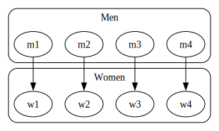

# Stable Marriage 

The _Stable Marriage Problem_ describes the problem of finding a stable matching (marriage) of two equally sized sets of elements with a given ordering of preferences for each element (men & women).

A matching is defined as a bijection from the elements of one set to the elements of the other set.

A matching is stable, if no two elements would prefer each other over their current partners.

## Gale-Shapley algorithm

One of the most famous algorithms to solve this problem ist the Gale-Shapley algorithm:

1. Each man proposes to the woman he prefers most
2. Every woman who receives a proposal:
    - accepts if she if free or prefers this man over her current fiancé
    - declines if she prefers her current fiancé
3. The rejected men propose to their next preferred woman
4. Step 3 is repeated until all men are engaged
